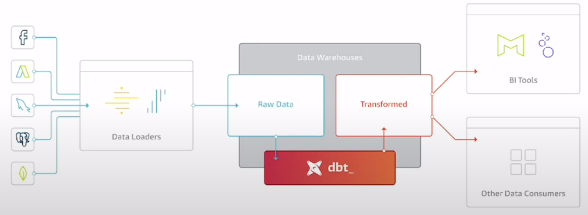

### Week 4 at DTC Data Engineering Zoomcamp: Analytical Engineering 

#### Overview 

#### What is analytical engineering and why we need them ?
We all know that there are two common roles involved when a company is dealing with data. The Data Engineer and The Data Analyst

Analytical engineers play a critical role in bridging the gap between data engineers, who prepare and manage the data infrastructure, and data analysts, who interpret data for insights. They apply their engineering skills to analyze and optimize the systems and processes used by data engineers and data analysts, ensuring that data flows efficiently and is utilized effectively.

An Analytical engineer has to take care of the following :

Data Loading -> Data Storing -> Data Modelling -> Data presentation.

The focus of this week will be on Data Modelling.

#### Kimball's Dimensional Modelling
The main principle of the Kimball dimesional modelling is to deliver understable data and fats query performance to the business users over non redundant data (3NF).

The elements of the dimensional modellling include :

* Facts Tables - Measurements, mEtrics or facts. QUantitavive metrics. These are the data points that analysts work with to make decisions. Have large number of rows.

* Dimensions Tables - Store the context for the quantitative metrics present in the fact tables. They help to describe the data in fact tables better.

Architecture of the Dimensional Modelling :

View this Dimensioal modelling in the light of a restaurant 

* Stage Area : Contains raw data. You do not expose this data to everyone. Only people who know how to work with the raw data see this. The produce section in a restaurant can be seen as a staging area. Only schefs who know how to select the ebst ingredients are allowed in this area.

* Processing Area: We take the raw data and build data models out of it. Here doing things efficiently and making sure that the right standards are maintained is very important. In a restaurant Kitchen is the example of a processing area. The raw material/produce selected in the earlier step is converted into tasty food taht can be served to the end users.

* Presentation Area: The data is finally presented to everyone here. The data is exposed to business stake holders.In the restaurant the dining room can be taken as an example of the presentation area. The final presentation of the dishes takes place in the dining room, where ambiance, plating, and service come together to create the final dining experience. 

#### DBT

 
A tranformation workflow that allows people to deploy analytics code that follows best software engineering practices like modularity, portability and CI/CD practices.

Consists of two main versions :

* dbt Core: Open source project, builds and runs a project and useful to run if the data is in local databases

* dbt Cloud: SaaS application which is very useful when we are dealing with warehouses like bigquery.

